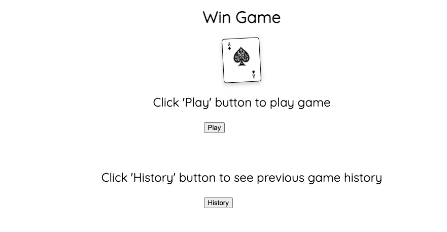
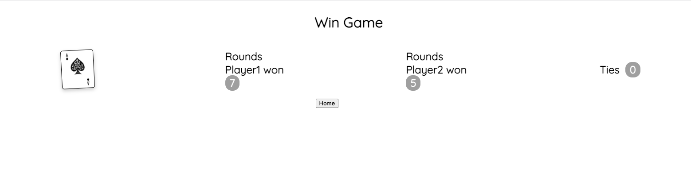

# War Card Game

# Introduction about this web app
This is a web app for war card game using django. It has three pages. 'Home' page, 'game' API page for starting a new game with two simulated players, and also 'summary' page for checking about history player's playing history.

# Rules
https://bicyclecards.com/how-to-play/war/
no jokers are used.
when in pairs, if one player has not enough card, that player lose.

# Instruction about how to run this

## django preparation
this is a django + html + css program. to run a django web app you need to:
a
1. Install Python 3
2. Create a virtual environment:
    cd <location for your virtual environment folder>
    python3 -m venv venv
3. Activate your virtual environment using the appropriate command for your shell:
    • MAC zsh: source venv/bin/activate
    • MS cmd.exe: venv\Scripts\activate.bat
    • Linux csh: source venv/bin/activate.csh
4. Install Django
    • Upgrade pip to the most current version:
    python3 -m pip install –-upgrade pip
    • Then install Django
    python3 -m pip install django
5. clone and try to run it:
    git clone https://github.com/chuchugo/war_game.git
    cd django-intro
    python3 manage.py migrate
    python3 manage.py runserver
6. Visit http://localhost:8000 and visit the below two web pages.

### start_game:
Visit localhost:8000/start. This page will return a JSON response.

after visiting the page, it will start a new round of game and return these info of the new game:

   - "initial_status": start cards of each player
   - "hands": what they had for each hand, and the result of each hand
   - "final_result":final result of the winner and loser of this round

    {"initial_status": 
    {"player1": ["Heart J", "Spade 6",...], "player2": ["Club Q", "Heart 5", ...]},"hands": 
    {"1": 
    {"player1": "Heart J", "player2": "Club Q"}, "2": 
    {"player1": "Spade 6", "player2": "Heart 5"}, "3":
     {"player1": "Club 9", "player2": "Diamond J"}, 
     .....},
    "final_result": "player1"}

### Summary of the game history
    - visit localhost:8000/history
    - this page will return a UI web page shoiwng lifetime wins for each player

# DB structure
## what is stored in db?
The rounds info:
    the id of the round
    the start cards of each player for each round
    each round result
    the timestamp

## what is not stored in db?
The cards of each hand of each player and the result of each hand

